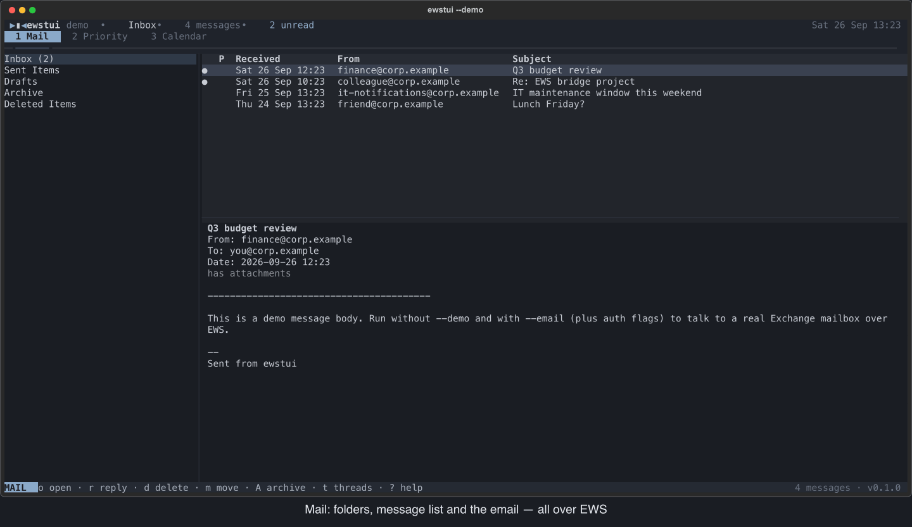

# ewstui

A terminal (TUI) email + calendar client for Microsoft Exchange, with
vim-style keybindings — talking **EWS directly**, no IMAP, no CalDAV,
no local gateway process, no JVM.

Built with [Textual](https://textual.textualize.io/) for the UI and
[`exchangelib`](https://github.com/ecederstrand/exchangelib) for the
Exchange side.



Every screen is fetched live from Exchange when you open it. Nothing
is cached to disk except, optionally, an OAuth2 refresh token — that's
auth-state, not mail-state; delete `~/.config/ewstui/token_cache.bin`
any time and it just re-prompts for login next run.

## Why this exists

If your Exchange server has IMAP disabled (common on locked-down
on-prem/enterprise deployments) but EWS is reachable, tools like
`aerc`/`neomutt` can't talk to it directly, and gateways like DavMail
require running a JVM. `ewstui` is a from-scratch client instead of a
gateway: it speaks EWS as its *only* protocol and renders the result
directly in the terminal, so there's no IMAP/CalDAV emulation layer
to get wrong.

## Install

```bash
uv sync
```

For `--auth kerberos`, include the optional extra: `uv sync --extra kerberos`.

## Try it without a server first

```bash
uv run ewstui --demo
```

This runs the full UI against fake in-memory mail + calendar data —
useful to check the keybindings and layout work in your terminal
before you touch a real mailbox. See `ewstui/demo_backend.py`.
The GIF above is recorded from demo mode by `uv run python scripts/demo_gif.py`
(needs `rsvg-convert` and `ffmpeg`).

## Run against a real mailbox

```bash
uv run ewstui --email you@corp.example --ews-url https://mail.corp.example/EWS/Exchange.asmx --auth auto
```

If you don't know your EWS endpoint, try `--autodiscover` instead of
`--ews-url` (requires Autodiscover to be reachable/working, which is
not a given on locked-down servers — an explicit `--ews-url` is more
reliable if you can get it from IT).

### Choosing `--auth`

| Value      | What it does | Needs |
|---|---|---|
| `oauth2`   | MSAL device-code flow. Prints a URL + code once; approve it in a browser. Refresh token cached to disk. | `--client-id` (Azure AD app registration), usually `--tenant-id` |
| `ntlm`     | Password sent straight through as NTLM. No disk state. | `--username`/`--email` + password (prompted, or `EWSTUI_PASSWORD` env var) |
| `basic`    | Same as ntlm but plain Basic auth. | same as ntlm |
| `kerberos` | Uses your existing ticket cache (`kinit`) via GSSAPI. No password. | system Kerberos + `uv sync --extra kerberos` |
| `auto` (default) | Tries `oauth2` first; if that's unconfigured or the server rejects it, falls back to `ntlm` automatically. | whatever either path needs |

Since you likely don't know in advance whether your on-prem server
supports modern auth (OAuth2 / Hybrid Modern Auth) or only NTLM,
`auto` is the sensible starting point — pass `--client-id`/`--tenant-id`
in case OAuth2 works, and it'll gracefully fall back to an NTLM
password prompt if not.

If your org uses ADFS rather than Azure AD for OAuth2, override the
token endpoint with `--oauth-authority https://adfs.corp.example/adfs`.

### NTLM domain

If your NTLM username needs a domain prefix (`CORP\jdoe` rather than
just `jdoe`), pass `--domain CORP` and it's prepended automatically.

### Password handling

Never pass `--password` on the CLI (it'd be visible in shell history
and `ps`). Either set `EWSTUI_PASSWORD` in the environment for a
scripted/non-interactive run, or just leave it unset — you'll get a
`getpass` prompt at startup.

**macOS Keychain + Touch ID**: after a successful login with a typed
password, ewstui asks whether to save it in your login Keychain
(service `ewstui`, one item per username + EWS URL). On later starts it
asks for Touch ID (or your Mac password if there's no sensor) and uses
the stored password; cancel the dialog to type it instead. If the
server rejects a stored password (e.g. after a password change) the
item is removed and the next run prompts again. `--forget-password`
deletes it; `--no-keychain` skips the Keychain entirely.

Note the Touch ID check is enforced by ewstui, not by the Keychain:
OS-level biometric protection needs a signed app with Keychain
entitlements. The item itself is protected like any login Keychain
item (encrypted, unlocked while you're logged in).

### Config file and accounts

Instead of repeating the flags, keep them as a named account in
`~/.config/ewstui/config.toml` (or `$XDG_CONFIG_HOME/ewstui/config.toml`;
override with `--config PATH`). The easiest way to create one is to
run with `--account NAME` plus your flags once — they're saved after
the connection succeeds, and the first account becomes the default:

```bash
uv run ewstui --account work --email you@corp.example \
  --ews-url https://mail.corp.example/EWS/Exchange.asmx --ntlm-no-cbt --domain CORP
uv run ewstui                 # uses default_account from then on
uv run ewstui --account work  # or pick one by name
```

```toml
default_account = "work"

[accounts.work]
email = "you@corp.example"
ews_url = "https://mail.corp.example/EWS/Exchange.asmx"
domain = "CORP"
ntlm_no_cbt = true
```

- Precedence: built-in defaults < the account's settings < flags on
  the command line.
- With `--account NAME`, any other flags you pass are saved into that
  account. Without it (default account), flags only apply to that run.
- Keys are the option names with `_` instead of `-` (`ews_url`,
  `priority_file`, `refresh_interval`, ...). The password, `--debug`
  and `--demo` are never stored.
- `layout = "stacked"` (or `--layout stacked`) puts the message list
  above the email, both to the right of the folders; the default
  `"columns"` has all three side by side.
- `theme = "nord"` (or `--theme nord`) picks the colour theme. The
  look — palette, header, status bar and help overlay — follows the
  [tuxedo](https://github.com/webstonehq/tuxedo) todo.txt TUI; its
  default **Muted Slate** palette is ewstui's default, and its **Nord**
  palette is the alternative.
- On/off flags like `--ntlm-no-cbt` can only be switched on from the
  command line; edit the file to turn one off. Comments you add to the
  file are kept when ewstui updates it.

### Troubleshooting the connection

Before the UI opens, ewstui checks the connection in plain terminal
output: it probes the EWS URL (reachability, TLS, which auth schemes
the server offers), then fetches the Inbox once with your credentials
(30 s timeout). On failure it exits with the error and hints instead
of opening an empty UI.

- `--debug` prints tracebacks and logs full EWS traffic to
  `ewstui.log` (it can contain mail content and auth tokens — delete it
  afterwards).
- **NTLM login hangs** (the Inbox check never answers, while
  `--auth basic` at least gets a quick reply): the server is likely
  behind a TLS-terminating proxy/load balancer (e.g. F5) that can't
  handle NTLM channel binding. Add `--ntlm-no-cbt`, e.g.
  `--ntlm-no-cbt --domain PROD --username jdoe`.
- In zsh/bash, quote `DOMAIN\user` (`--username 'PROD\jdoe'`) or the
  backslash is eaten — or use `--domain` instead.
- **NTLM logins stall or time out** behind a gateway (the connection
  indicator sits on `◐ waiting for server`, or requests keep timing
  out): gateways such as F5 can hang on NTLM's multi-step login. Try
  Basic with your *plain* user id — `--auth basic --username B123456`
  (still encrypted over HTTPS, and no handshake to stall on) — and save
  it once with `--account NAME --auth basic --username B123456`.
- **Caching and prefetching**: emails you've opened are kept in memory
  for the session (the most recent 200; nothing is written to disk), so
  going back to one is instant. Exchange's change key — already in the
  message list — tells ewstui when an email changed, so a stale copy is
  never shown. When the cursor rests on an email, the next two are
  downloaded in the background; the status bar shows `⇣ prefetching 2`
  meanwhile. Prefetching never counts as "waiting for server" or as a
  connection problem.
- **Connection indicator**: the right of the status bar shows
  `● connected`, `● working` (a request is running),
  `◐ waiting for server 12s` (a slow or stalled request — the seconds
  count up) or `✕ connection problem (2m ago)` until the next request
  succeeds. ewstui keeps up to 3 connections, so one stalled request
  doesn't hold up the others.
- **Freezes after being idle**: gateways, firewalls and sleep can drop
  idle connections without telling either end. ewstui guards against
  this: TCP keepalive on every connection (probes after 30 s of
  silence), connections unused for over 2 minutes are replaced before
  the next request, requests time out after 30 s (not exchangelib's
  120 s) with one retry for reads, and emails load in the background so
  the UI stays usable. A `connection problem ... retrying` line in
  `ewstui.log` shows a retry; with `--debug` you also see `session idle
  ... reconnecting` each time a stale connection is replaced.

## Priority list (`2`)

A local, `todo.txt`-formatted list for triaging mail — separate from
any Exchange folder, stored only on your machine at
`~/.local/share/ewstui/priorities.todo.txt` (override with
`--priority-file`). It's a plain [todo.txt](https://github.com/todotxt/todo.txt)
file, so any other todo.txt tool can read/edit it too (they'll just
see the `@email` context and the `id:`, `folder:`, `from:` fields as
ordinary text).

You can point it at the todo.txt you already use (`priority_file =
"..."` in your account): ewstui only shows and changes the entries it
created — those in the `@email` context (entries with the older
`+email` project tag still count, and switch to `@email` when ewstui
next changes them) — and leaves every other line exactly as it was. It re-reads the file whenever it changed on disk, so edits
from another todo.txt app or a sync client show up straight away and
are never overwritten. The priority view's header names the file in
use, and the "Added to priority list" notice shows its full path.

**In the mail list**, the **P** column shows each email's priority
letter, `-` if it's on the list without one yet.

**Add a message to the list**: from the mail view, select a message
and press `P` (shift+p) to add it straight to the priority list with
no priority set yet and no prompt — or `p` to do the same but first
prompt you for a short note, which gets appended to the entry's text
(e.g. "Re: EWS bridge project — waiting on legal sign-off"). Either
way it's an unprioritized todo.txt line (no `(X)` prefix); set its
priority later from the priority view.

**Work the list**: press `2` (or click the **Priority** tab) to
switch to the priority view. It's sorted `A` first through `Z`, then
unprioritized, then by the date added.

- `A`–`Z` on the row under your cursor — reprioritizes just that item.
- `V` — start a visual selection at the current row (vim visual-line
  style); `j`/`k` extend it; pressing a letter applies that priority
  to every selected row at once and exits visual mode; `Esc` cancels
  without changing anything.
- `x` — toggle complete (writes `x <date>` per the todo.txt spec, and
  remembers the old priority as `pri:A` so it's not lost).
- `d` — remove from the priority list (does not touch the actual
  email or Exchange).
- `Enter`/`o` — jump straight to that email (switches to the mail
  view, opens its folder, puts the cursor on it and shows it in the
  reading pane).

**Emails that move**: each entry stores the email's Internet
Message-ID (`msgid:<…>`), which — unlike Exchange's own item id —
never changes. Moving an email with `m`, `A`, `d` (or undoing with
`u`) updates its entry right away. If it was moved elsewhere (Outlook,
a rule), jumping to it searches your mail folders for the Message-ID
(one request), opens it wherever it is now and updates the entry.
Entries made before Message-IDs were stored get theirs the first time
you open the email.

Example line this produces:
```
(A) 2026-09-24 Q3 budget review @email id:AAMkAD...== folder:AAMkAD... from:finance@corp.example msgid:<0978d17921ac@corp.example>
```

## Attachments (`v`)

From the mail view, press `v` on a message to list its attachments
(no-op with a "No attachments" notice if there are none). `j`/`k` to
move, `Enter`/`l` to pick one — it's saved and then opened with the
system's default app (`open` on macOS, the file association on
Windows, `xdg-open` on Linux). If that isn't possible, you still get
the saved path in the notification so you can open it yourself.

Where it's saved: `--attachment-dir` (or `attachment_dir` in the
account's config) if set; otherwise on macOS
`~/Downloads/Attachments/<account>` — the `--account`/default account
name, or your email address when no account profile is in use — and
`~/Downloads/ewstui-attachments` elsewhere.
Re-downloading the same file never overwrites a previous copy — it's
suffixed `(1)`, `(2)`, etc.

Only real file attachments are downloadable; an attachment that's
itself an embedded email or calendar item (e.g. a forwarded message)
shows up greyed out in the list since EWS represents those
differently and this doesn't handle that case yet.

## Keybindings

Press `?` inside the app for the full list: a panel with every section
side by side (stacked on narrow terminals; `j`/`k` or `Ctrl+d`/`Ctrl+u`
scroll it, `Esc`/`?`/`q` close it). The status bar at the bottom always
shows the current mode and the most useful keys for the pane you're in.
Summary:

`o` (or `Enter`) opens whatever's under the cursor *and* moves focus
into the next pane over (folders → messages → reading pane). `l`/`h`
do the same moving right/left, vim-style (as do `Tab`/`Shift+Tab`);
`h` moves back without changing what's displayed. The status bar
suggests whichever fits the layout: `l` when the email is to the right
of the list (`columns`), `o` when it's below it (`stacked`). Plain `j`/`k`
navigation never steals focus on its own — moving through the message
list with `j`/`k` just live-updates the reading pane, the same as
mutt/aerc; only an explicit open shifts focus there.

**Global**: `j`/`k` move, `g`/`G` top/bottom, `o`/`Enter` open, `l`/`h`
(or `Tab`/`Shift+Tab`) next/previous pane, `1`/`2`/`3` switch to mail/priority/calendar
view (also shown as clickable mode tabs under the header, with the
active one highlighted), `Ctrl+l` refresh, `q` quit, `?` help.

**New mail**: `Ctrl+l` checks for new mail now (in the calendar or
priority view it reloads that view instead). ewstui also checks in the
background every 5 minutes (`--refresh-interval MINUTES`, `0` turns it
off) and shows e.g. "New mail: Inbox (+2)". Fetching happens off the UI
thread, and the cursor and open message stay where they were.

**Mail**: `r` reply, `R` reply-all, `w` compose new, `d` delete,
`Space` toggle read/unread, `P` add to priority list (no priority,
no prompt), `p` add to priority list with a note, `A` archive, `m`
move to folder, `t` thread view, `v` view/save/open attachments, `u`
undo.

**Links** (`U`): lists the links in the email shown in the reading
pane (web and `mailto:` links, with the text just before each so you
can tell them apart). `j`/`k` and Enter — or just `1`–`9` — open one in
your default browser; `Esc` cancels. Only `http(s)` and `mailto` links
are ever opened.

**Recipients** (`e`): the reading pane shows people by name, with a
long To or Cc list folded onto one line ("Anna Berg, Bo Christensen …
+14 more"). `e` — or a click on "+14 more" — lists everyone, one per
line with their address; `e` again folds it. Each new email starts
folded.

**Several at once** (`V`): starts a selection at the current email;
`j`/`k` grow or shrink it (selected rows are highlighted, and the
status bar shows how many). Then `d` delete, `A` archive, `m` move
(one folder pick for all), `Space` mark read — or unread, if they're
all read already — or `P` add them all to the priority list. The work
runs in the background, one failure doesn't stop the rest, and a single
`u` undoes the whole batch. `Esc` (or `V` again) cancels the selection.

**Thread view** (`t`, or start in it with `threads = true` in your
account / `--threads`): messages in the same conversation are shown
together as an upside-down tree — the newest message on top, the
original at the bottom, and each reply connected to the message it
answers (`┌─`, `├─`, `│`) — placed in the list by the thread's most
recent message. The top row and the original show the subject; replies
in between that keep the thread's subject show just the tree guide.
Every row is still one message, so opening and `r`/`d`/`m`/... work on
exactly the row you're on. Like Outlook, threads include your own
replies from Sent Items, marked `(sent)` — ewstui fetches one page of
recent Sent Items and matches them to the folder's conversations.

**Moving mail** (`m`): opens a folder picker for the message under the
cursor. Folders you've moved mail to this session are listed first,
then the rest in folder-pane order. Start typing to fuzzy-filter by
folder path (e.g. `prew` finds `Projects/EWS`); `↓`/`↑` or
`Ctrl+n`/`Ctrl+p` choose, Enter moves, Esc cancels. After a move,
delete or archive the cursor stays on the next message, and `u` puts
the message back.

**Reading pane** (after `o`/`Enter` moves focus into it): `j`/`k`
scroll a line, `Ctrl+d`/`Ctrl+u` half a page, `Ctrl+f`/`Ctrl+b` (or
`Space`) a full page, `g`/`G` top/bottom, `h` back to the list.

**Deleting and undo**: `d` moves the message to Exchange's **Deleted
Items** folder (same as Delete in Outlook) — nothing is purged. `u`
moves the most recently deleted, archived or moved message back to the folder
it came from; press it repeatedly to walk back further. The undo
history lasts for the session only; after a restart, recover from
Deleted Items by hand. Pressing `d` *inside* Deleted Items soft-deletes
the message (only recoverable via Outlook/OWA's "Recover deleted
items") and can't be undone with `u`.

**Calendar**: `n` new event, `f` find a free meeting room, `d` delete
event, `[`/`]` shift the visible date range.

**Finding a room** (`f` in the Calendar tab): shows one day as a grid —
a row per room in your account's config, a column per half hour of your
working day (taken from your Outlook working hours if the server
provides them, else 08:00–17:00), `███` busy and `·` free. It's one EWS
GetUserAvailability call per day, with no access to the rooms' calendars
needed. `[`/`]` go to the previous/next day (`t` back to today), or Tab
to the date field, type a date and Enter; `j`/`k` pick the room and
`h`/`l` (or `w`/`b`, `←`/`→`) the time. The status line says whether the
room is free for the chosen duration from that slot; Enter opens a new
event prefilled with that slot and room. Or press `v` to start a visual
selection and move to cover the rooms and times you want: Enter books
all selected rooms for that span in one invite (it refuses if any
selected cell is busy, and says which), `v`/`Esc` cancels the
selection. Saving the event invites the room(s) as resources, and each
room's booking assistant accepts or declines it
(check your calendar/inbox for its reply). List the rooms in the config
file, by name or as plain addresses:

```toml
[accounts.work.rooms]
"G-5222 Havgus (8 pers)" = "room-g5222@corp.example"
"Stormen"                = "room-stormen@corp.example"
# or: rooms = ["room-g5222@corp.example", "room-stormen@corp.example"]
```

Or find them from the grid: press `/`, type part of a room's name and
Enter. ewstui searches your organisation's room lists (if your admins
set any up) and the directory; directory hits can also be people, so
each result says where it came from. Pick one with `j`/`k` and Enter:
it's added to the grid and saved to the account's `rooms` in the config
file (needs `--account`/`default_account`; otherwise it's only added
for this session). With no rooms configured, the grid opens empty so
you can start with `/`.

The grid caches each day it has loaded, so paging between days is
instant; press `r` to throw that away and fetch fresh availability.

**Priority list**: `A`-`Z` set priority, `V` visual-select, `x` toggle
complete, `d` remove, `Enter`/`o` jump to email.

**Compose/new-event modals**: `Ctrl+S` send/save, `Esc` discard.
In compose, `Cmd+Enter` also sends — if your terminal passes the Cmd
key through (Ghostty, kitty and WezTerm do; in iTerm2 enable Profiles →
Keys → "Report keys using CSI u"; Terminal.app can't).

## Project layout

```
ewstui/
  config.py        CLI args -> Config dataclass
  auth.py           oauth2 / ntlm / basic / kerberos / auto -> exchangelib.Account
  ews_client.py      Live MailClient + CalendarClient wrapping exchangelib
  demo_backend.py    Fake in-memory stand-ins for --demo (same interface as ews_client)
  keymap.py          Single source of truth for the help-screen text
  screens.py         Modal screens: compose/reply, new event, help
  priority_store.py  Local todo.txt-backed priority list (parse/format/store)
  app.py             Main Textual App: three-pane mail view + calendar + priority views
  widgets/
    folder_list.py    Left pane
    message_table.py  Middle pane
    preview.py         Right pane
    calendar_view.py   Calendar agenda view
    priority_view.py   Priority list view (visual-select + reprioritize)
```

`app.py` never imports `exchangelib` directly — it only knows the
plain dataclasses in `ews_client.py` (`MessageSummary`, `EventSummary`,
etc.), which is what lets `--demo` swap in fake data with zero changes
to the UI code.

## Known limitations (v1)

- **Folder lookup is O(folders) per call** (`MailClient._folder_by_id`
  walks the folder tree each time) — fine for normal mailbox folder
  counts, but a hot path worth caching if you have hundreds of folders.
- **Embedded-item attachments** (a forwarded email or calendar invite
  attached as an item, rather than a file) aren't downloadable yet —
  `v` will show them in the list greyed out with a note, but selecting
  one just beeps rather than crashing.
- **No search** — `/` is documented as a future binding but not wired
  up yet.
- **No offline/local cache** — by design (see "Why this exists"), but
  it does mean no network = no mail. If you want offline reading,
  that's a different, larger project (sync EWS -> local Maildir, point
  a separate reader at that).
- **Kerberos path is untested** against a real KDC — the plumbing is
  there (`GSSAPI` auth_type via `requests-gssapi`) but wasn't
  exercised against a live server while building this.
- **OAuth2 scope is hardcoded** to
  `https://outlook.office365.com/EWS.AccessAsUser.All` — if your
  Azure AD app registration exposes a different scope, edit
  `DEFAULT_OAUTH_SCOPE` in `auth.py`.

- **`A` (archive) requires a folder literally named "Archive"** in
  your mailbox — `MailClient._find_archive_folder` looks it up by
  name (case-insensitive) under the mailbox root, since on-prem EWS
  doesn't expose a dedicated "online archive" well-known folder the
  way some cloud setups do. If you don't have one, create it once
  (or move a message into a folder called that manually) and archiving
  will find it from then on.

## Testing changes

There's no formal test suite yet, but `--demo` mode plus Textual's
`App.run_test()` (headless pilot testing) is how this was built and
verified — see the project history for example smoke-test patterns:
drive the app with `pilot.press("j")`, `pilot.press("enter")`, etc.,
and assert on `app.current_folder_id` / widget row counts.
